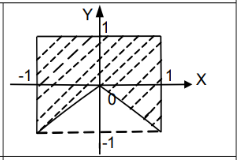

# Оценка 5 — Точка в закрашенной области (вариант 8, Скорпион)

## Задача

Даны вещественные `x`, `y`. Определить, принадлежит ли точка `(x, y)` заштрихованной области из варианта **8** (Скорпион) в `1.pdf`.

## Область из задачника



Из чертежа:

- Верхняя половина квадрата `[-1, 1] × [0, 1]` — закрашена полностью.
- В нижней половине закрашены **два боковых треугольника** над прямыми `y = -x` (слева) и `y = x` (справа). Центральный «нос» `y < -|x|` не закрашен.
- Точки вне квадрата `[-1, 1] × [-1, 1]` — не принадлежат.

## Система неравенств

Точка `(x, y)` лежит в области ⟺ выполнены **все** условия:

$$
-1 \le x \le 1, \quad -1 \le y \le 1, \quad y \ge -|x|
$$

Третье неравенство объединяет верхнюю половину (`y ≥ 0 ≥ -|x|`) и два боковых треугольника снизу.

## Код

[area.c](area.c) — ключевое:

```c
#include <math.h>

int inside =
    (x >= -1.0 && x <= 1.0) &&
    (y >= -1.0 && y <= 1.0) &&
    (y >= -fabs(x));
```

> `fabs()` из `<math.h>` — модуль вещественного числа. Линковать с `-lm`.

## Сборка

```bash
gcc area.c -o area -lm
./area
```

Ввод: два вещественных числа через пробел или с новой строки.

## Тесты

| `x` | `y` | Ожидаем | Почему |
|---|---|---|---|
| `0` | `0` | YES | начало координат, на границе `y = -\|x\|` |
| `0` | `0.5` | YES | верхняя половина |
| `0` | `-0.5` | NO  | в «носу» V (`y < -\|x\| = 0`) |
| `0.5` | `-0.3` | YES | правый нижний треугольник (`-0.3 > -0.5`) |
| `-0.7` | `-0.5` | YES | левый нижний треугольник (`-0.5 > -0.7`) |
| `-1` | `-1` | YES | угол квадрата, на границе |
| `0` | `-1` | NO  | нижняя точка V, `-1 < -\|0\| = 0` |
| `2` | `0` | NO  | за границей квадрата |
