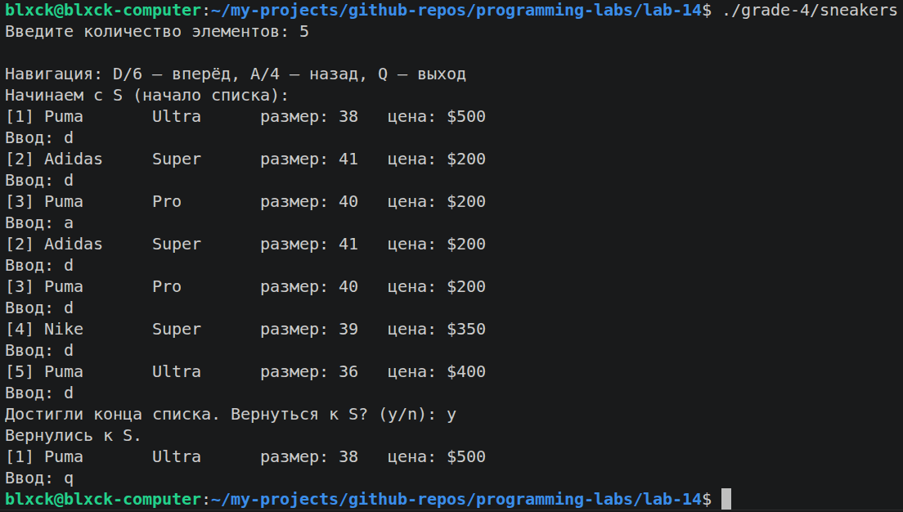
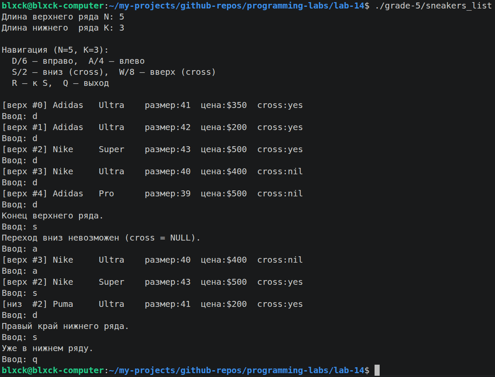

# Лабораторная работа №14 — Связные списки

  

> Вариант 21 «Кроссовки» (тот же домен, что в [lab-12](../lab-12) и [lab-13](../lab-13)). Идея — постепенный переход от обычного односвязного списка к двусвязному и затем к двухрядной сетке со «cross»-ссылками.

## 📊 Прогрессия по оценкам

| Grade | Тип структуры | Управление | Папка |
|---|---|---|---|
| 3 ★   | Односвязный список (`next`) | `PushBack` через двойной указатель, вывод последовательно | [grade-3](grade-3) |
| 4 ★★  | Двусвязный (`next + prev`) | Интерактивная навигация **D / A** | [grade-4](grade-4) |
| 5 ★★★ | Два ряда: верхний N, нижний K (разные длины) + cross-ссылки | Навигация **W / A / S / D / R** (R — переход через cross) | [grade-5](grade-5) |

## 🗂 Структура

```
lab-14/
├── README.md
├── Makefile                       # диспетчер: вызывает Makefile в grade-N
├── Лабораторная работа №14.pdf
├── grade-3/
│   ├── main.c, Makefile
│   └── README.md
├── grade-4/
│   ├── include/list.h
│   ├── src/{main.c, list.c}
│   ├── Makefile
│   └── README.md
└── grade-5/
    ├── include/list.h
    ├── src/{main.c, list.c}
    ├── Makefile
    └── README.md
```

## ⚙️ Сборка и запуск

```bash
make all                    # собрать все три grade
make grade-3                # только односвязный
make grade-4                # двусвязный с навигацией
make grade-5                # двухрядный

./grade-3/sneakers
./grade-4/sneakers          # интерактивный, D = вправо, A = влево, Q = выход
./grade-5/sneakers
make clean
```

## 📸 Скриншоты

| Что | Где |
|---|---|
| Интерактивная навигация D/A по двусвязному списку (grade-4) |  |
| Двухрядный список с cross-навигацией WASDR (grade-5) |  |

## 🧠 Что отрабатывается

- **`malloc + free` для узлов** — каждый элемент списка выделяется отдельно.
- **Двойной указатель `Node **`** — для `PushBack` без специальных проверок на пустой список.
- **Прошивка `prev`** — позволяет идти назад без хранения предыдущего узла в локальной переменной.
- **Cross-ссылки** — нестандартное расширение, при котором узел верхнего ряда указывает не только на соседей, но и на «партнёра» в нижнем ряду.
- **Освобождение списка** — рекурсивно `free` каждого узла, иначе утечка.
