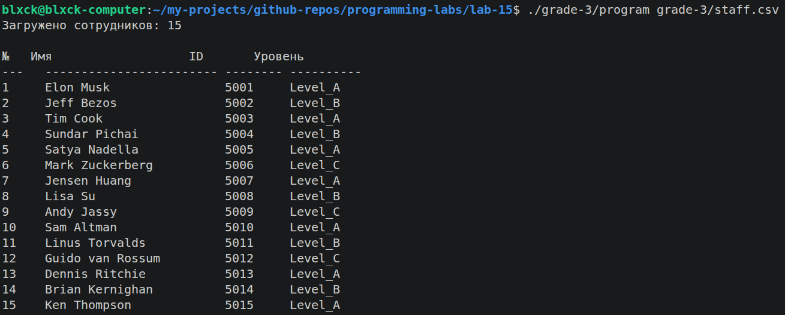
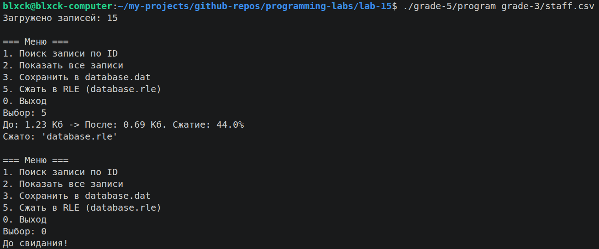

# Лабораторная работа №15 — Работа с текстовыми и бинарными файлами

  

> Чтение CSV, парсинг через `strtok`, сериализация в бинарный `.dat`, поиск по ключу через `fread`, RLE-сжатие. Дополнительно — вариант на чистых системных вызовах `open/read/write` без stdio.

## Предметная область

База данных сотрудников: имя, ID, уровень (Level_A / Level_B / Level_C).

## Структура

| Папка | Оценка | Описание |
|-------|--------|----------|
| `grade-3/` | 3★ | Чтение CSV через `fgets` / `strtok`, вывод таблицы. Также содержит вариант на системных вызовах |
| `grade-5/` | 4–5 | Включает весь функционал оценки 4 (бинарный `database.dat`, поиск по ID через `fread`) + RLE-сжатие, декомпрессия, конвертация между форматами |

> **Примечание:** отдельной папки `grade-4/` нет — соответствующий функционал (сохранение в `.dat` и поиск по ID) полностью реализован в `grade-5/`.

## Общие требования

- Программа обрабатывает ошибки открытия, чтения и записи файлов
- Все функции возвращают `-1` при ошибке и выводят сообщение в `stderr`

## ★ Вариант с системными вызовами

`grade-3/main_syscall.c` — полный аналог `main.c` без функций стандартной библиотеки:

| `stdio.h` | Системный вызов |
|-----------|---|
| `fopen()` | `open()` |
| `fgets()` | `read()` побайтово + ручной поиск `\n` |
| `printf()` / `fprintf()` | `write()` в `STDOUT_FILENO` / `STDERR_FILENO` |
| `fclose()` | `close()` |

## Формат CSV

Разделитель — `;`, без заголовка:

```
Имя;ID;Уровень
James Wilson;6001;Level_B
Elon Musk;5001;Level_A
```

## Сборка и запуск

```bash
make all              # собрать все grade (через диспетчер в корне)
make grade-3
make grade-5
make clean

# или вручную внутри подпапки:
cd grade-N && make && ./program <файл>
```

## Тестовые файлы

- `grade-3/staff.csv` — основная база сотрудников
- `grade-5/staff2.csv` — дополнительный набор для тестирования парсера

## 📸 Скриншоты

| Что | Где |
|---|---|
| Таблица сотрудников после парсинга CSV (grade-3) |  |
| Отчёт RLE-сжатия: исходный → сжатый размер (grade-5) |  |
