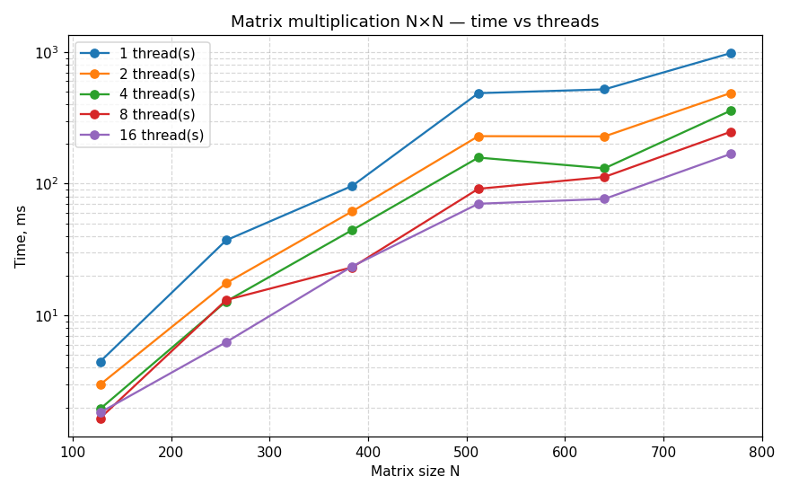
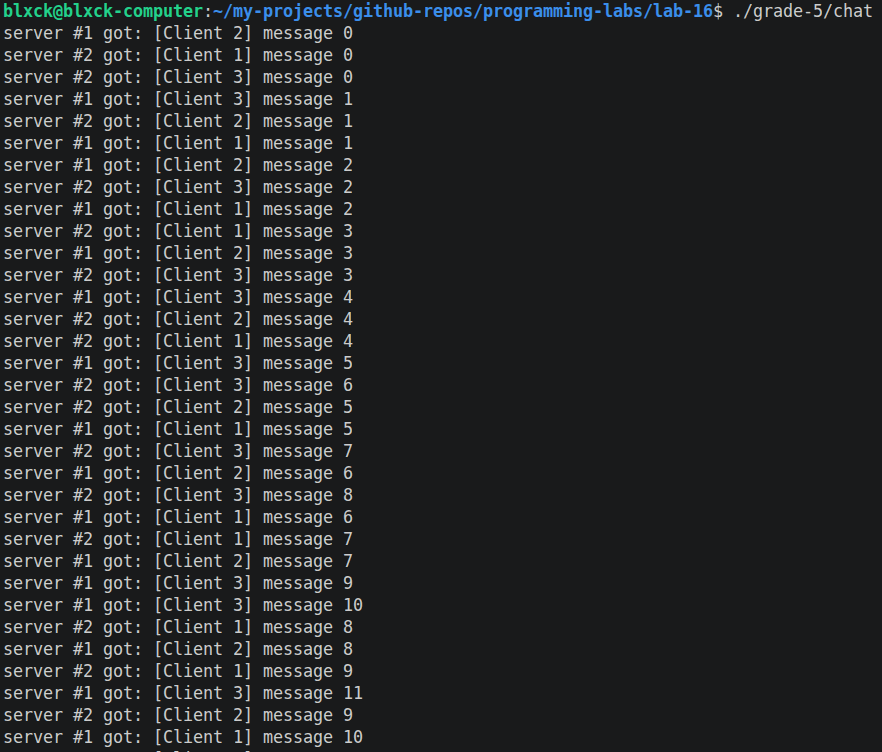
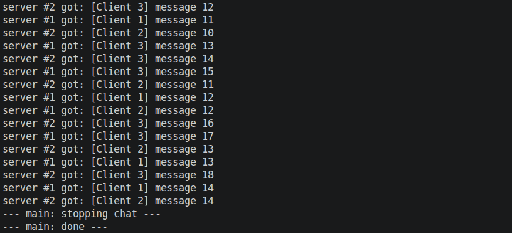
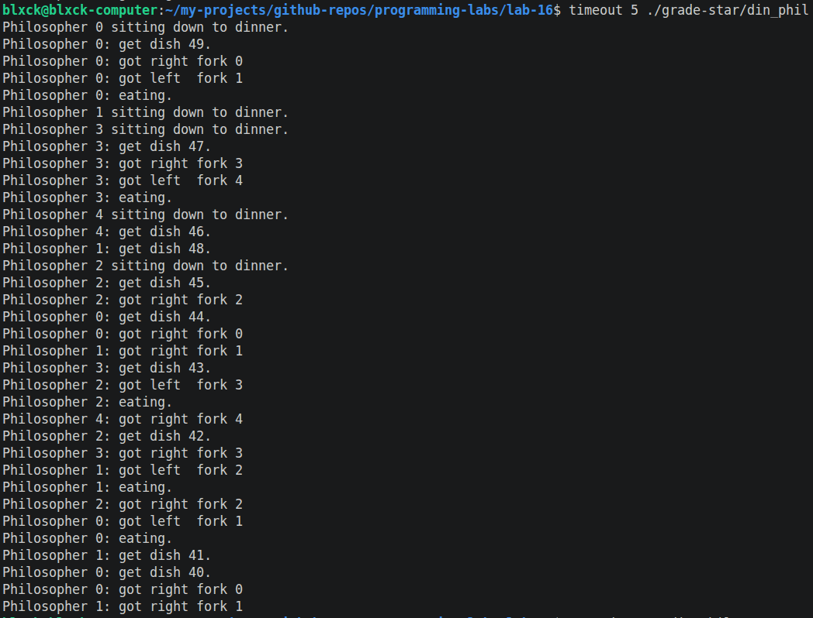

# threads.md — Отчёт по лабораторной №16

Краткий обзор выполненной работы по POSIX-потокам. PDF требует отдельный markdown-файл с описанием экспериментов, графиками и скриншотами — это он.

## 📋 Что сделано

| # | Упражнение | Где |
|---|---|---|
| 1 | `pthread_create` — родитель и ребёнок параллельно печатают строки | [grade-3/ex1_create.c](grade-3/ex1_create.c) |
| 2 | `pthread_join` — родитель ждёт ребёнка | [grade-3/ex2_join.c](grade-3/ex2_join.c) |
| 3 | 4 потока, у каждого своя структура с параметрами | [grade-3/ex3_args.c](grade-3/ex3_args.c) |
| 4 | `pthread_cancel` через 2 секунды | [grade-3/ex4_cancel.c](grade-3/ex4_cancel.c) |
| 5 | `pthread_cleanup_push` — прощальное сообщение при отмене | [grade-3/ex5_cleanup.c](grade-3/ex5_cleanup.c) |
| 6 | Sleepsort O(N) на pthread | [grade-3/ex6_sleepsort.c](grade-3/ex6_sleepsort.c) |
| 7 | Mutex + condition variable для очерёдного вывода | [grade-4/ex7_sync.c](grade-4/ex7_sync.c) |
| 8 | Перемножение матриц N×N, распараллеливание по строкам | [grade-4/ex8_matmul.c](grade-4/ex8_matmul.c) |
| 9 | Тот же matmul + замер времени + график | [grade-4/ex9_benchmark.c](grade-4/ex9_benchmark.c) |
| 10 | FIFO-очередь сообщений + чат на N клиентов / M серверов | [grade-5/](grade-5/) |
| ★ | Обедающие философы — дедлок и его устранение | [grade-star/](grade-star/) |

---

## 1–6: знакомство с pthread

**Ex1.** Один поток выводит строки одновременно с родителем — порядок строк хаотичен. Это и есть «параллельность» по умолчанию.

**Ex2.** С `pthread_join` родитель явно ждёт ребёнка → ребёнок печатает все 5 строк до того, как родитель начнёт.

**Ex3.** Все 4 потока разделяют одну функцию `worker()`, отличаются только параметрами. Вывод пёстрый: `[A] apple`, `[D] dog`, `[B] bread`, …

**Ex4.** В функции потока бесконечный цикл с `sleep(1)`. `sleep()` — точка отмены (cancellation point), поэтому через 2 секунды `pthread_cancel()` гасит потоки в нужном месте.

**Ex5.** Та же отмена, но в функцию потока добавлено `pthread_cleanup_push(cleanup, …) … pthread_cleanup_pop(0)`. При отмене вызывается `cleanup` и печатает `worker X: cleanup — saying goodbye`. Полезно для освобождения ресурсов.

**Ex6.** Sleepsort: для каждого числа создаётся поток, который спит `value × 50 ms` и печатает значение. Маленькие просыпаются раньше → вывод отсортирован. Время выполнения — `O(N)` если ядер достаточно (`max(values) × 50 ms`).

```
$ ./grade-3/ex6_sleepsort 5 2 8 1 3
1
2
3
5
8
```

---

## 7: синхронизация через mutex + condition

Чтобы parent и child печатали строго по очереди, добавил общий счётчик `turn` и одну condition variable. Каждый поток в цикле:

```c
pthread_mutex_lock(&lock);
while (turn != MY_TURN)
    pthread_cond_wait(&cv, &lock);
print();
turn = OTHER_TURN;
pthread_cond_signal(&cv);
pthread_mutex_unlock(&lock);
```

`while (turn != ...)` — защита от spurious wakeup.

---

## 8: матрицы NxN

A и B заполняются единицами, поэтому C должна состоять из чисел, равных N. Эта инвариантность встроена в самопроверку — программа печатает `OK` или `FAIL`.

Распараллеливание — простая «полоса» по строкам:

```
Threads  A                 B               C
T1       [строки 0..2)  ×  вся B   =       [строки 0..2)
T2       [строки 2..4)  ×  вся B   =       [строки 2..4)
T3       [строки 4..6)  ×  вся B   =       [строки 4..6)
...
```

Если N не делится нацело, остаток идёт в последний поток.

---

## 9: замер времени → график

Серия запусков `ex9_benchmark` для N ∈ {128, 256, 384, 512, 640, 768} и T ∈ {1, 2, 4, 8, 16}. Результаты сохраняются в [grade-4/benchmark.csv](grade-4/benchmark.csv), график — [grade-4/benchmark.png](grade-4/benchmark.png).



### Что видно

1. **Время растёт как N³.** На лог-Y кривые почти прямые с одинаковым наклоном.
2. **Многопоточность даёт ощутимое ускорение** до 4–8 потоков. После плато: больше потоков, чем физических ядер, не помогает (и иногда мешает — borьба за кеш, лишние переключения контекста).
3. **На малых N (≤ 128)** одно-поточная версия часто *быстрее* — создать pthread занимает ~100 µs, а сама задача уже считается ~3 ms.
4. **Cache effects**: для N ≈ 384–512 многопоточный вариант обгоняет однопоточный в 5–10 раз. Дальше эффекты L3-кеша становятся заметны.

---

## 10: FIFO-очередь и чат

Структура `Queue` — кольцевой буфер на 10 слотов, один `pthread_mutex_t`, два `pthread_cond_t` (`not_full`, `not_empty`). Три клиента-продюсера спят 100–500 ms, генерируют сообщения; два сервера-консьюмера принимают и печатают.

Дополнительно реализован `msgDrop()` — выставляет флаг `dropped`, делает `pthread_cond_broadcast` на обе condition. Все ждущие просыпаются и возвращают −1. Без этого механизма аккуратно остановить чат в `main` было бы невозможно.

Пример работы:

```
server #1 got: [Client 1] message 0
server #2 got: [Client 2] message 0
server #2 got: [Client 3] message 0
server #1 got: [Client 3] message 1
server #2 got: [Client 1] message 1
...
--- main: stopping chat ---
--- main: done ---
```




---

## ★ Обедающие философы

Оригинал из ветки `kruffka/C-Programming@2025-2026/16_threads/src/din_phil.c` зависает (дедлок) если запустить **без аргумента**: все 5 философов одновременно хватают по правой вилке и ждут левую, образуя круговую зависимость.

Фикс — **асимметричный захват**:

| id | чётность | сначала | потом |
|---|---|---|---|
| 0 | even | left = 1 | right = 0 |
| 1 | odd  | right = 1 | left = 2 |
| 2 | even | left = 3 | right = 2 |
| 3 | odd  | right = 3 | left = 4 |
| 4 | even | left = 0 | right = 4 |

Теперь философы 0 и 1 оба пытаются взять вилку 1 первой. Кто-то один её получит, другой просто подождёт — круг разорван.

Проверка:

```
$ time ./grade-star/din_phil_fixed > /tmp/p.log
real    0m10.234s

$ tail -2 /tmp/p.log
Philosopher 3 is done eating.
Philosopher 0 is done eating.
```

Воспроизводимый дедлок исходной версии (зависает и не печатает финальные строки):



---

## 🛠 Полезные инструменты при отладке

| Команда | Что даёт |
|---|---|
| `gcc -fsanitize=thread …` | data race, неправильная синхронизация (ThreadSanitizer) |
| `gcc -fsanitize=address …` | переполнения буферов в общих структурах |
| `valgrind --tool=helgrind` | анализ блокировок, lock ordering inversion |
| `gdb -p <pid>` → `info threads` → `thread N` → `bt` | посмотреть, где зависли потоки при дедлоке |

---

## 📌 Выводы

1. POSIX threads — низкоуровневый, но мощный API. Несложно сделать гонку данных и дедлок, поэтому без mutex/condition не обойтись.
2. Многопоточное ускорение работает только до количества аппаратных ядер, дальше — синхронизация съедает прирост.
3. **Дедлок** не лечится «спать перед захватом», только **изменением порядка ресурсов** (иерархия / асимметрия) или **семафорной квотой**.
4. ThreadSanitizer ловит большинство ошибок синхронизации, но не дедлок — для дедлока — `gdb -p` + `thread apply all bt`.
