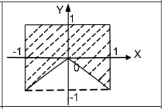

# Точка в области — вариант 8

Здесь главное — перевести картинку с закрашенной областью в условие для `x` и `y`. Для «Скорпиона» это квадрат от −1 до 1 по обеим осям, из которого снизу исключён центральный треугольник.



Проверка в [area.c](area.c): `-1 <= x <= 1`, `-1 <= y <= 1` и `y >= -fabs(x)`. Граница тоже входит в область.

```bash
gcc area.c -o area -lm
./area
```

Например, `0 0.5` и `0.5 -0.3` дают YES, а `0 -0.5` — NO.
